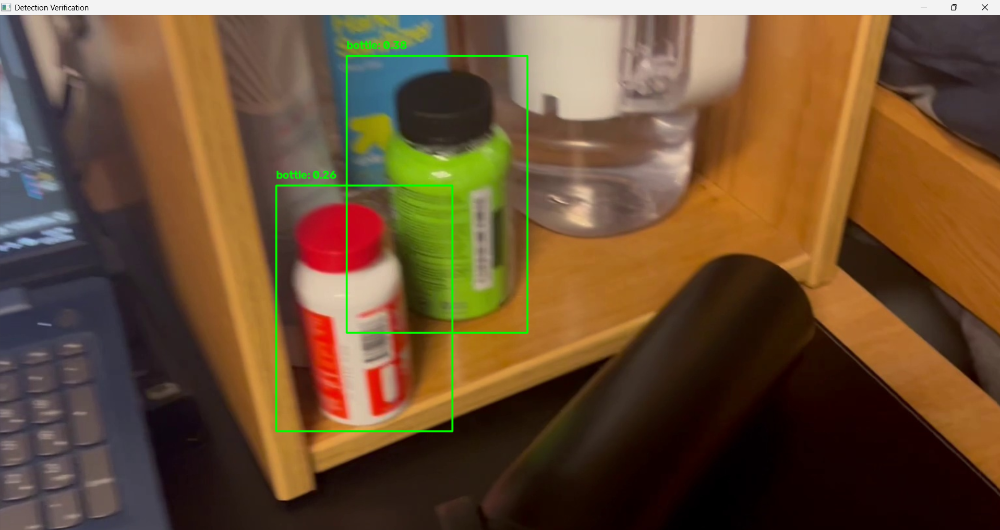
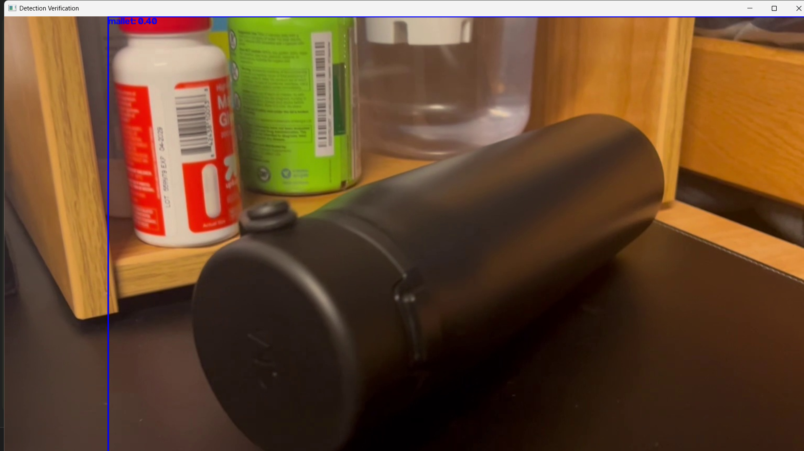
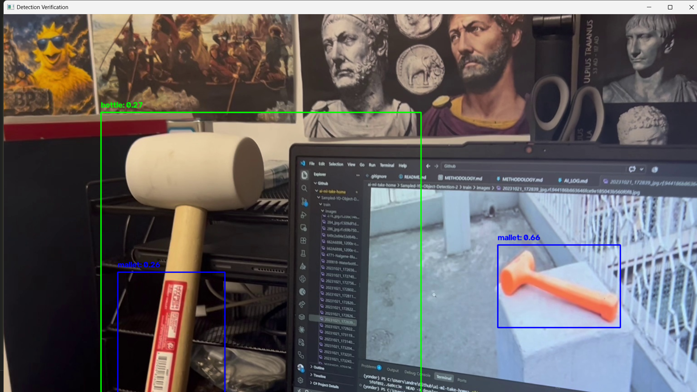
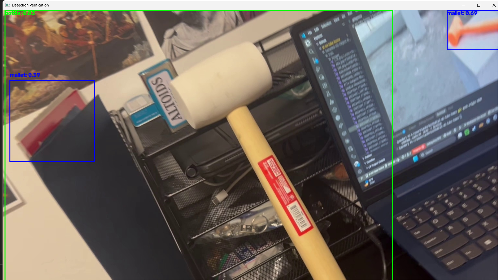
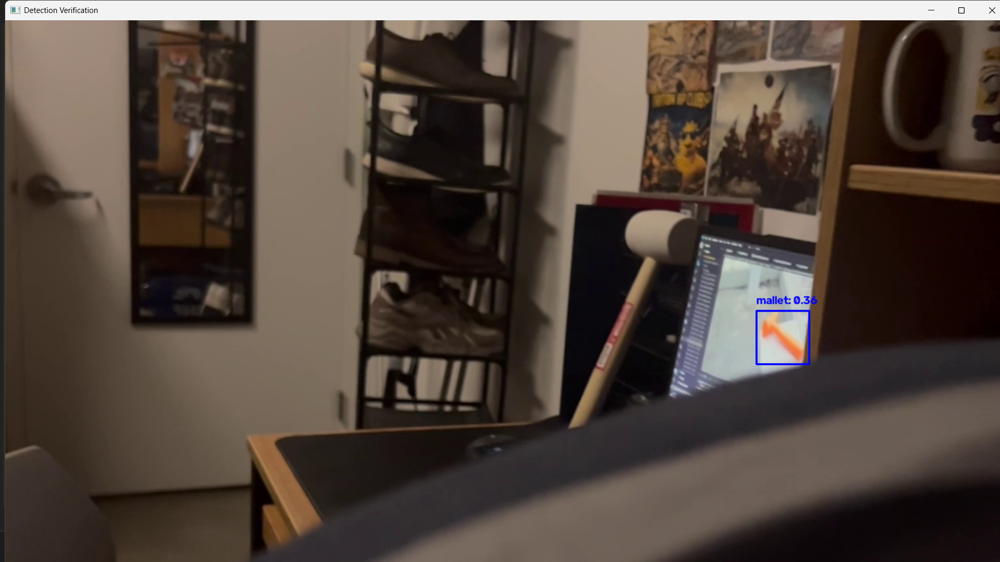

# Test

I recorded a 46-second **Test Video**. It can be found in *videos/*, with **136 frames** in *frames/TestVideo* and the box boundings in *inferences/TestVideo*. While there were cases of accurate detection, most inferences either omitted bounding boxes for mallets or bottles or noted a shape and misclassified it. In some of the most egregious cases objects were recognized where they did not exist.

You can watch the video for yourself to understand more about the pictures if you wish.

Overall, it was far less accurate than on the training data, and several issues were found with identification, and some exact cases are explained below.

## The Images

### Different Bottles Detected

Command run: `python utils/visualize.py --image frames/TestVideo/frame_0010.jpg --box inferences/TestVideo/frame_0010.txt`

In this image, we can see that the model detects two vitamin bottles, and does not detect the large black water bottle below, which I intended for it to catch. My point in putting the black water bottle on a black surface was to test edge detection, but it seems that the sheer recognizability of the bright shapes of the vitamin bottles overrided this and caused a larger, but less colorful object not to be detected.

This showed me:

- The model would not always predict what I expected it to.
- Bright shapes win over ones more similar to their environment.
- On Mars, where object/rock/feature colors are similar, this may be an issue.

### Bottle Detected as Mallet

Command run: `python utils/visualize.py --image frames/TestVideo/frame_0017.jpg --box inferences/TestVideo/frame_0017.txt`

With more focus on the black water bottle, its shape has been detected as a mallet instead. This is not what I expected to happen. In addition to it being the same color as its background, I additionally laid it on its side so that it would be detected from a different angle. In most of the test images from Roboflow, bottles were depicted upright, so I wanted to counter that, but it was not successful.

This showed me:

- Angle matters. In addition to not having as many bottle images as mallet ones, the bottles were mostly upright.
- The angle may be why the upright colorful bottles were detected (they were upright) and the water bottle was not.
- The facedown orientation of the water bottle more matches how the mallets were depicted in some of the training data.

### Mallet Detected as Mallet and Bottle

Command run: `python utils/visualize.py --image frames/TestVideo/frame_0032.jpg --box inferences/TestVideo/frame_0032.txt`

In this image, I placed my upright mallet next to my computer, which shows a mallet image from the Roboflow training data. Although the physical mallet was larger in the photo, the whole shape was not detected as a mallet. This may be due to several confounding factors, such as the full mallet not being in view (handle is somewhat cut off) and the head of it being the same shade as the wall.

This showed me:

- The model instantly recognizes its own training data, but not my introduced mallet.
- The red sticker was detected as a mallet, perhaps because it is close to the orange shade of the training data.
- The full mallet was detected as a bottle, which may be due to its lighter color.

### Ghost Mallet

Command run: `python utils/visualize.py --image frames/TestVideo/frame_0042.jpg --box inferences/TestVideo/frame_0042.txt`

In this image, we see that there is no mallet - it is a CVS photo folder - but the model has detected a mallet. I did not consider this would even be considered by the model so it was an interesting case to find that it did. Building on the previous photo, we see the big mallet has still not been detected.

This showed me:

- Color seems to matter, a lot. The red photo folder was detected as a mallet. 
- Upon inspection of the training data, most mallets are orange. 
- Similar color and rectangular shape could be why the sliver of the red folder was detected as a mallet.
- Mallets are often captured from farther away in the training data than my physical mallet is in the photo.

### Colored Mallet Detection

Command run: `python utils/visualize.py --image frames/TestVideo/frame_0111.jpg --box inferences/TestVideo/frame_0111.txt`

This photo shows that on a simulated "real environment", where the lights have been turned down and there is rough ground in front of the camera, the orange mallet photo is still being detected as a mallet, while the large physical mallet is not.

This showed me:

- When light has been reduced, the images that stand out are most recognizable.
- Though the mallet picture is small and is hardly more than a rectangle, it is still being found.
- The model heavily biases toward the bright orange mallet.

## Improvement

The tests showed:

- Orientation Matters. When different from training data, objects tend not to be recognized.
- Color Matters. When colors are not bright, objects are ignored or misidentified.
- Real Data is Different. The training showed high accuracy after training, while the real tests show little.

The model heavily biases toward bright bottles and the orange mallet. Inspecting the dataset, it is easy to see why, as these are what most often occur in the dataset. This prevents shape from overcoming circumstance and allowing mallet and bottle shaped objects to be recognized when they differ too much from the data.

### Solution

**The data must be diversified**. Mallet images must be in a wider range of colors and in less discernable settings to allow YOLO to detect based on shape and lines rather than contrast.

**The dataset should be more representational**. The bottles recieve a far lesser share of the training data than the mallets, meaning that they are harder to detect, and when they are detected, observations are loose.

**Training strategies must adapt**. I trained this model on 40 epochs as I believed this would produce a result which would more reliably know how to detect mallets and bottles. Yet because the data did not accurately provide enough scenarios, I actually *increased bias* with more epochs, teaching the model to detect only what it has seen.

### Takeaways

Data matters a lot for training ML models. It is not the size of the set, but the quality - many similar images do little compared to a wider and more versatile set. 

Additionally, more epochs and a longer training time is not automatically better. More epochs can increase bias and longer time may be due to unoptimized hardware.

To construct a reliable ML detection model for a Mars Rover, we need to add more augmentations, such as scale, to improve recognizability as images are approached, and we must emphasize edge detection rather than color detection by not making objects as easily recognizable in the training data.